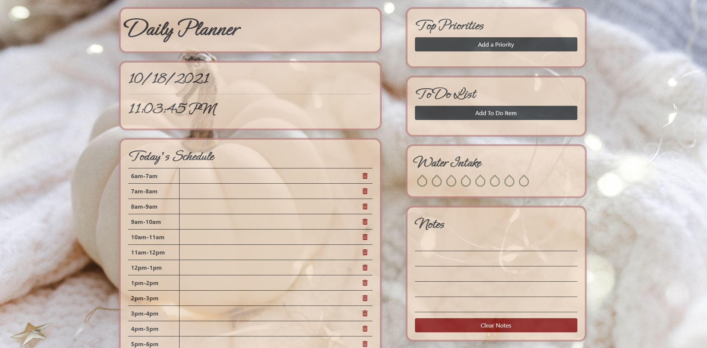

# React Daily Planner

Click [here](https://maxx105.github.io/react_day_planner/) to open deployed Github pages application.

## Description 
This is a simple daily planner app that is built using React. 

## Table of Contents 
* [Technologies](#Technologies)
* [Usage](#Usage)
* [License](#License)
* [Badges](#Badges)
* [Tests](#Tests)
* [Questions](#Questions)

## Technologies 
* This application is written using the React.js javascript framework as well as JSX.
* It uses CSS/Bootstrap for styling.

## Usage 
If using from the Github pages deployed application, just go to the deployed application's [link](https://maxx105.github.io/react_day_planner/). You can set a daily schedule by adding hourly tasks, adding top priorities, adding to do list items, adding water intake, adding notes, and setting the next day's plan. All data is saved to local storage and at midnight every night, the storage is cleared to ensure the user sets a new plan for a new day.

## License 
 MIT

## Badges 
 
 

## Tests 
 No tests are currently in place for this project.

## Questions 
 For any questions, contact me at [maxxsanner105@gmail.com](mailto:maxxsanner105@gmail.com).
#### 